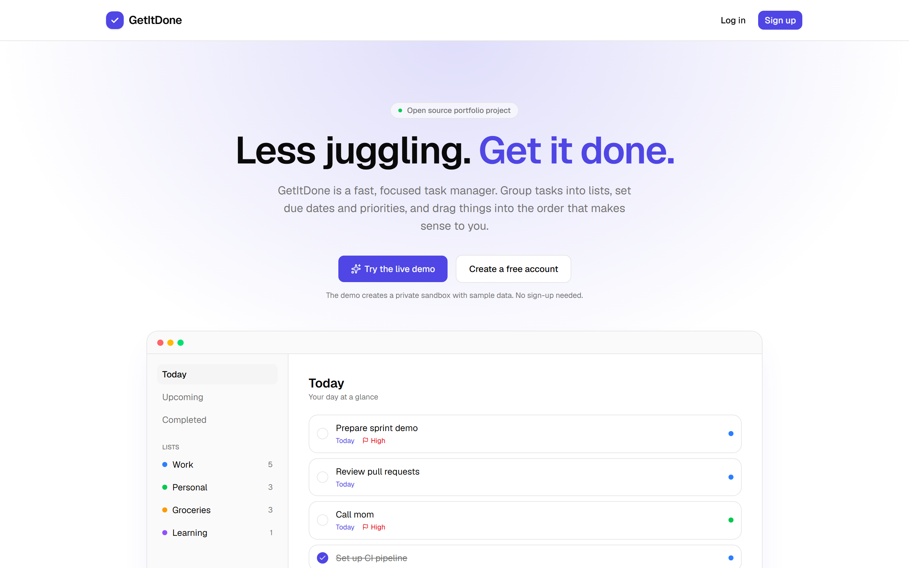
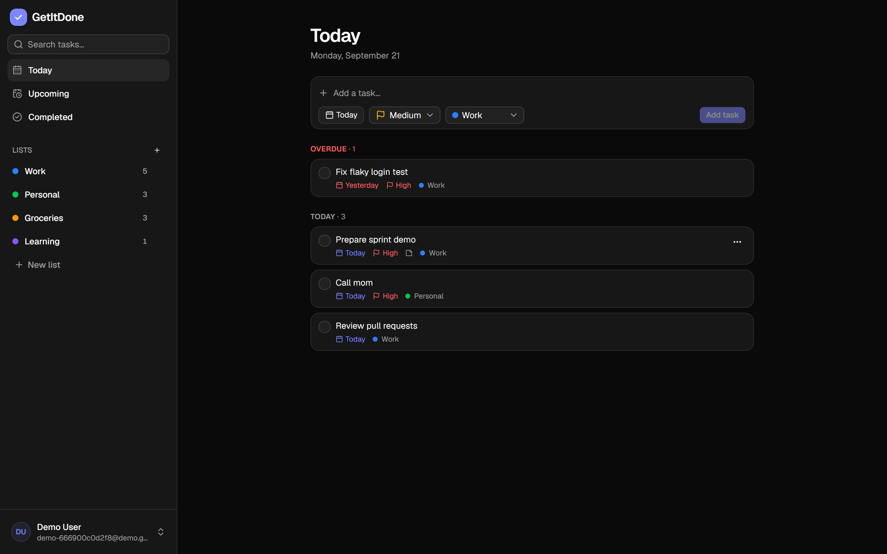
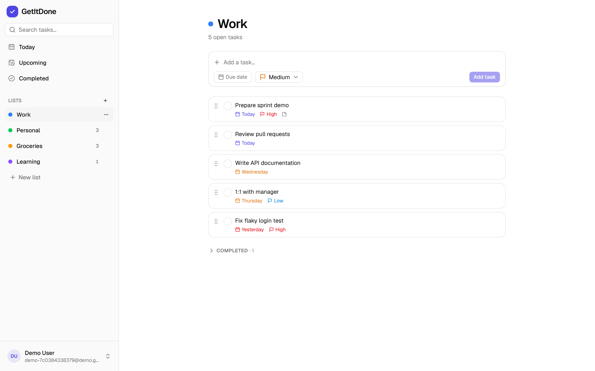
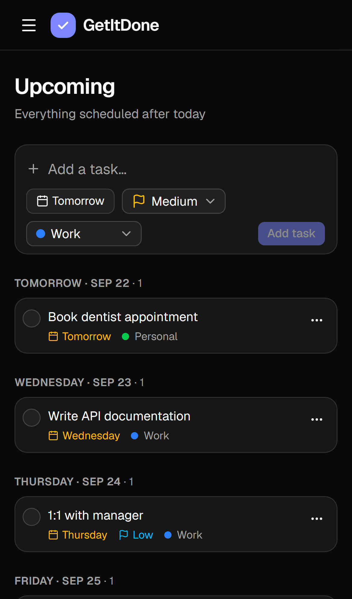
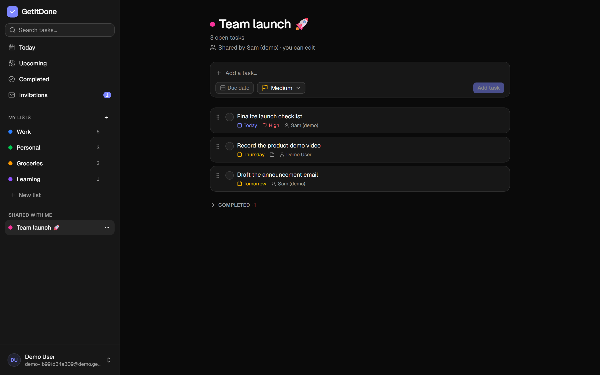
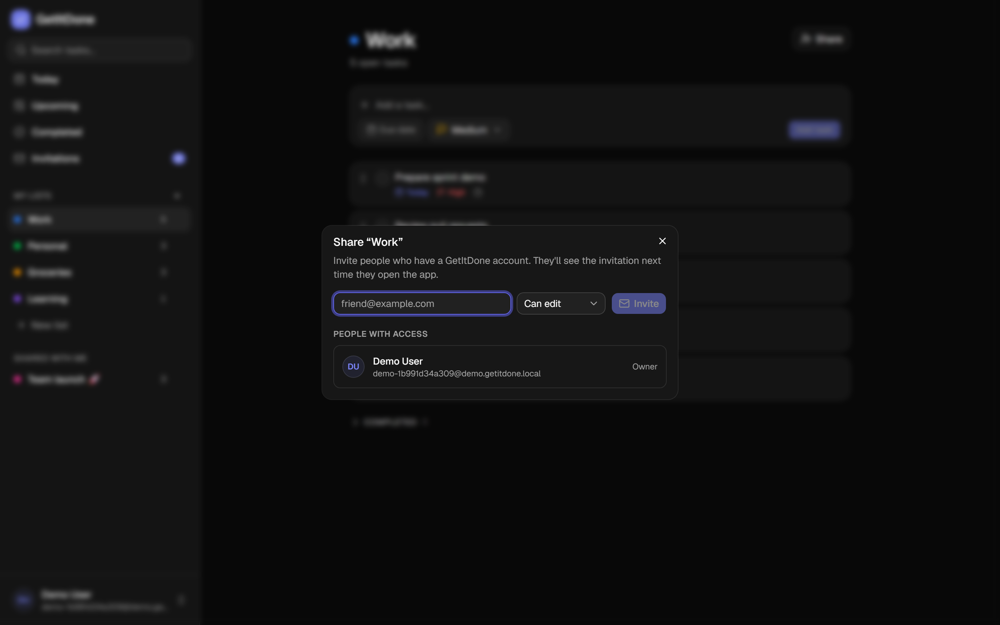
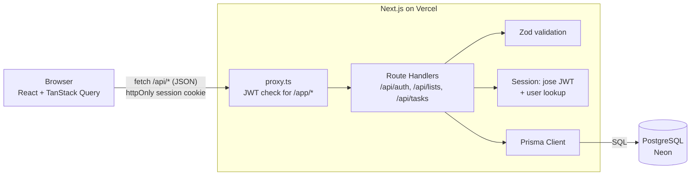

# GetItDone

[](https://github.com/Xyjor/getitdone/actions/workflows/ci.yml)

A full-stack task manager: sign up, organize tasks into lists, set due dates and priorities, and drag tasks into the order you want. Built with Next.js, TypeScript, PostgreSQL and Prisma, with hand-rolled JWT authentication.

**🔗 Live demo: [getitdone-plum.vercel.app](https://getitdone-plum.vercel.app)** · Click **"Try the live demo"** to get a private sandbox with sample data. No sign-up needed.



| Today view (dark) | List view with drag-and-drop | Mobile |
| --- | --- | --- |
|  |  |  |

| A list shared with you | Sharing a list |
| --- | --- |
|  |  |

## Features

- **Authentication:** sign up, log in, log out. Sessions are signed JWTs in `httpOnly` cookies, and passwords are hashed with bcrypt.
- **Revocable sessions and account settings:** see every signed-in device, sign out any of them, log out everywhere, change your password (other devices are signed out), and delete your account.
- **Rate limiting:** brute-force protection on login, sign-up and the demo, stored in Postgres (no paid service).
- **Shared lists with roles:** invite people by email as **Editor** or **Viewer**. Collaborators' changes appear within seconds, tasks show who added them, and members can leave. The demo includes a list shared by "Sam (demo)" and a pending invitation.
- **Lists and tasks (full CRUD):** create, rename, recolor and delete lists. Tasks have titles, notes, due dates and priorities, and can move between lists.
- **Smart views:** Today (including overdue), Upcoming (grouped by day), Completed, and search across all tasks.
- **Drag-and-drop reordering** with mouse, touch or keyboard (dnd-kit).
- **Instant UI:** optimistic updates with TanStack Query, rolled back automatically if the server rejects a change.
- **Responsive:** sidebar on desktop, slide-out drawer on mobile.
- **Dark mode:** follows the system setting or a manual choice.
- **One-click demo:** each visitor gets an isolated sandbox account, and demo accounts are cleaned up after 24 hours.

## Tech stack

| Layer | Tools |
| --- | --- |
| Framework | Next.js 16 (App Router, Route Handlers, Proxy), React 19, TypeScript |
| UI | Tailwind CSS v4, shadcn/ui (Radix), lucide-react, next-themes, sonner |
| Data fetching | TanStack Query |
| Validation | Zod, with schemas shared by the client and server |
| Database | PostgreSQL (Neon), Prisma 7 ORM with the `pg` driver adapter |
| Auth | `jose` (JWT, HS256), `bcryptjs` |
| Testing | Vitest (unit and API integration), Playwright (end-to-end, desktop and mobile) |
| CI/CD | GitHub Actions, Vercel |

## Architecture



### Sharing and roles

| Action | Owner | Editor | Viewer | Anyone else |
| --- | --- | --- | --- | --- |
| See the list and its tasks | ✅ | ✅ | ✅ | 404 |
| Add, edit, complete, delete, reorder tasks | ✅ | ✅ | 403 | 404 |
| Rename, recolor or delete the list | ✅ | 403 | 403 | 404 |
| Invite people, change roles, remove members | ✅ | 403 | 403 | 404 |
| Leave the list | — | ✅ | ✅ | 404 |

- **One access layer** (`src/lib/access.ts`): every list and task route goes through `requireListRole` / `requireTaskRole`. Someone with no access always gets **404**, so the API never reveals that a list exists. Members whose role is too low get **403**. A table-driven integration test checks every action against every role.
- **Invites go to existing accounts only.** Sign-up doesn't verify email ownership (that would need an email service), so an invite waiting for a future sign-up could be claimed by whoever registers that address first. Telling the owner "no account uses this email" reveals nothing new, because sign-up already reports taken emails. Invites expire after 14 days, a list holds at most 20 people, invites are rate-limited, and demo accounts can't invite real accounts.
- **Only the owner sees email addresses.** Collaborators see each other's names only.
- **Live updates without paid services:** shared lists poll every 10 seconds (views that include shared lists poll every 30). Polling pauses while the tab is hidden, while a change is still saving, and after 5 minutes without input, so idle tabs let the database scale to zero.
- **Zero-downtime migration (expand/contract):** instead of renaming `Task.userId`, the change shipped in three releases:
  1. Add `createdById`, backfill it, and write both columns.
  2. Stop writing `userId`.
  3. Backfill any gaps and drop `userId`.

  At every step, the version already live kept working while the next one built, and a rollback stayed possible.

### Security decisions

- **Token storage:** the JWT lives in an `httpOnly`, `Secure`, `SameSite=Lax` cookie, so page scripts can't read it (unlike `localStorage`).
- **CSRF:** `SameSite=Lax` cookies, plus a server-side `Origin` check on every state-changing request.
- **Authorization:** every query filters by the signed-in user's id. Requesting another user's list or task returns `404`, so the API doesn't even reveal that it exists. This is covered by a dedicated integration test.
- **No user enumeration:** login returns the same error, in about the same time, for unknown emails and wrong passwords.
- **Revocable sessions:** each JWT names a `Session` row and is only honoured while that row exists. Logging out deletes the row, so a copied token stops working immediately. Changing the password revokes every other session.
- **Rate limiting:** a single atomic Postgres upsert per check (fixed window), so parallel requests can't race past a limit. Login is limited per IP and per account (5 attempts per 15 minutes, counted before the password check and reset on success). Sign-up and demo are limited per IP, and IPv6 clients are grouped by /64. Responses are `429` with `Retry-After`. Keys are HMAC-SHA256 hashed with a server secret, so no raw IPs or emails are stored.
  - *Trade-off:* anyone can temporarily lock a known email by failing its login 5 times. That's accepted here in exchange for stopping password guessing, and the lock lifts after 15 minutes.
- **Defense in depth:** the proxy only checks that the JWT is valid. The app layout and every API route still load the user from the database.
- **Validated input:** all input goes through Zod on the server, with the same schemas reused on the client for instant form feedback.
- **Safe redirects:** the `?next=` redirect after login only allows same-site paths.

## API

| Method | Endpoint | Description |
| --- | --- | --- |
| `POST` | `/api/auth/register` | Create an account and start a session |
| `POST` | `/api/auth/login` | Log in |
| `POST` | `/api/auth/logout` | End the session |
| `POST` | `/api/auth/demo` | Create a sandbox demo account |
| `GET` | `/api/auth/me` | Current user |
| `POST` | `/api/auth/logout-all` | End every session of the user |
| `PATCH` / `DELETE` | `/api/account` | Change name / delete account (password confirmation) |
| `POST` | `/api/account/password` | Change password (signs out other devices) |
| `GET` | `/api/account/sessions` | Signed-in devices |
| `DELETE` | `/api/account/sessions/:id` | Sign out one device |
| `GET` | `/api/lists/:id/members` | Owner and members (owner also gets emails and pending invites) |
| `POST` | `/api/lists/:id/invites` | Invite an existing account `{ email, role }` (owner) |
| `DELETE` | `/api/lists/:id/invites/:inviteId` | Revoke an invite (owner) |
| `PATCH` / `DELETE` | `/api/lists/:id/members/:userId` | Change a role (owner) / remove a member, or leave |
| `GET` | `/api/invites` | Invitations addressed to me |
| `POST` | `/api/invites/:id/accept` · `/decline` | Respond to an invitation |
| `GET` | `/api/cron/cleanup` | Daily cleanup of expired sessions, stale rate-limit rows and old demo accounts (Vercel Cron, `CRON_SECRET`) |
| `GET` / `POST` | `/api/lists` | List all lists (with open-task counts) / create a list |
| `GET` / `PATCH` / `DELETE` | `/api/lists/:id` | Read / update / delete a list (deleting a list deletes its tasks) |
| `GET` / `POST` | `/api/tasks?listId=&view=all\|today\|upcoming\|completed&q=&today=YYYY-MM-DD` | Query tasks / create a task |
| `GET` / `PATCH` / `DELETE` | `/api/tasks/:id` | Read / update / delete a task |
| `POST` | `/api/tasks/reorder` | Save a new order for a list's tasks |

Errors use one consistent shape: `{ "error": { "message": string, "fieldErrors"?: Record<string, string[]> } }`.

## Getting started

**Requirements:** Node.js 20.9+ and a PostgreSQL database. A free [Neon](https://neon.tech) database works, or use Docker with the included `docker-compose.yml`.

```bash
git clone https://github.com/Xyjor/getitdone.git
cd getitdone
npm install
cp .env.example .env        # then fill in DATABASE_URL, JWT_SECRET and CRON_SECRET
npx prisma migrate dev      # create the tables
npm run db:seed             # optional: demo@getitdone.dev / password123
npm run dev                 # http://localhost:3000
```

If you're using Docker instead of Neon, start the local database with `npm run db:up` before running the migration.

### Scripts

| Script | What it does |
| --- | --- |
| `npm run dev` | Start the dev server |
| `npm run build` / `npm start` | Production build / server |
| `npm run lint` / `npm run typecheck` | ESLint / TypeScript checks |
| `npm test` | Unit and API integration tests (Vitest, needs a database) |
| `npm run test:e2e` | End-to-end browser tests (Playwright) |
| `npm run db:migrate` / `db:seed` / `db:studio` | Prisma migrations / seed data / database GUI |

## Testing

- **Unit tests:** validation rules, JWT signing and verification (tampering, wrong secret, expiry), password hashing, date formatting, redirect safety.
- **API integration tests:** run the real route handlers against a real database, covering auth flows, CRUD, filters, reordering, cross-origin blocking, **data isolation between users**, session revocation (a replayed token after logout is rejected), password changes, account deletion, rate limiting, the cleanup cron, and a **permission matrix** covering every sharing action for owner, editor, viewer and outsider. It also checks cross-list ID tampering, invitations and membership changes.
- **End-to-end tests:** sign up → create a list → add, complete, edit and delete tasks → reload → log out → log back in, plus the demo flow, signing out another device from Settings, password change, login lockout, and a two-browser sharing flow (invite → accept → collaborate → downgrade to view-only). They run on both desktop and mobile viewports.

CI runs everything on each push against a throwaway Postgres container.

## Project structure

```
src/
  app/
    (auth)/login, register     # auth pages
    app/                       # the signed-in app (today, upcoming, completed, lists/[id], search)
    api/                       # REST route handlers
    page.tsx                   # landing page
  components/                  # app shell, sidebar, task components, shadcn/ui
  hooks/                       # TanStack Query hooks with optimistic updates
  lib/                         # auth, db client, validation, API helpers
  proxy.ts                     # protects /app/* routes
prisma/                        # schema, migrations, seed
tests/                         # Vitest unit and integration tests
e2e/                           # Playwright tests
```

